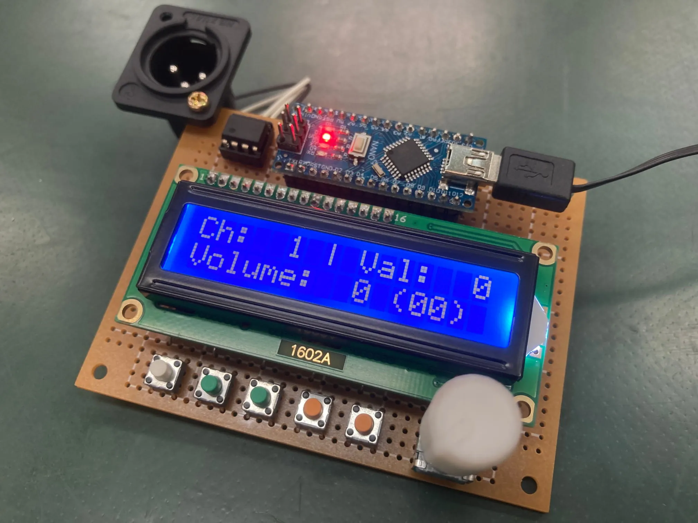
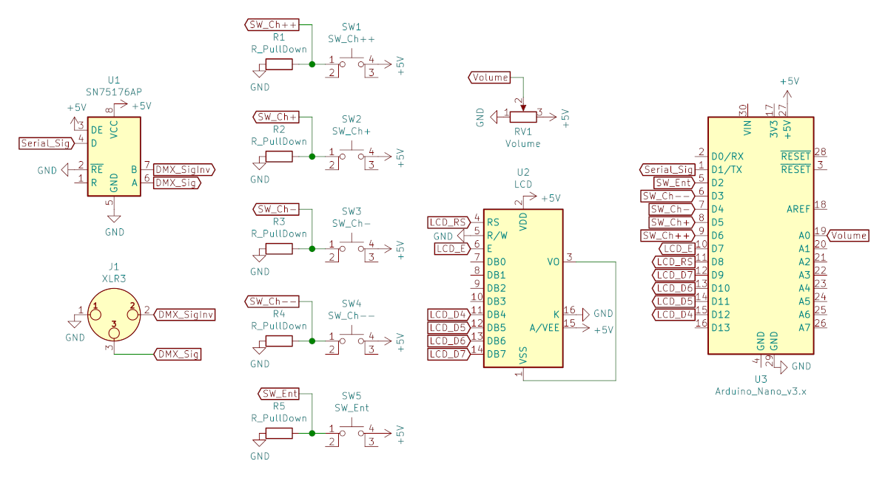
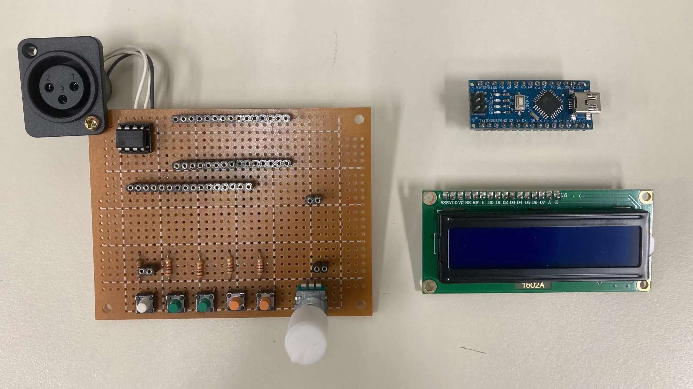
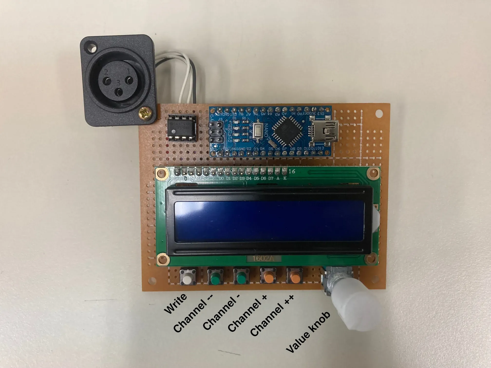

# DMX-MiniController

Handheld DMX controller

> [!WARNING]
>
> The image's assemble has a mistake. DMX output should be XLR female connector, but it's male.

## Step of production

At first, build a circuit.

Schematic is below:

> [!NOTE]
>
> You can see PDF of the schematic in `schematic/`. Also [KiCAD](https://www.kicad.org/) Eeschema `.sch` file is contained.

Next, upload firmware to arduino nano on the circuit.

Firmware source is in `DMX-MiniController_Arduino`. Open it by arduino IDE, then upload.

It's ready.

## Usage

- Write switch
  - Apply value to current channel
- Channel -- / - (decrement) switch
  - Decrement current channel
  - `--` for -10, `-` for -1
- Channel + / ++ (increment) switch
  - Increment current channel
  - `+` for +1, `++` for +10
- Value knob
  - Set value to write

Example steps of set channel 4 value to 100:

1. Click Channel+ switch, then set current channel 4
2. Rotate value knob, then set value 100
3. Click Write switch

## License

[CC0](./LICENSE)
